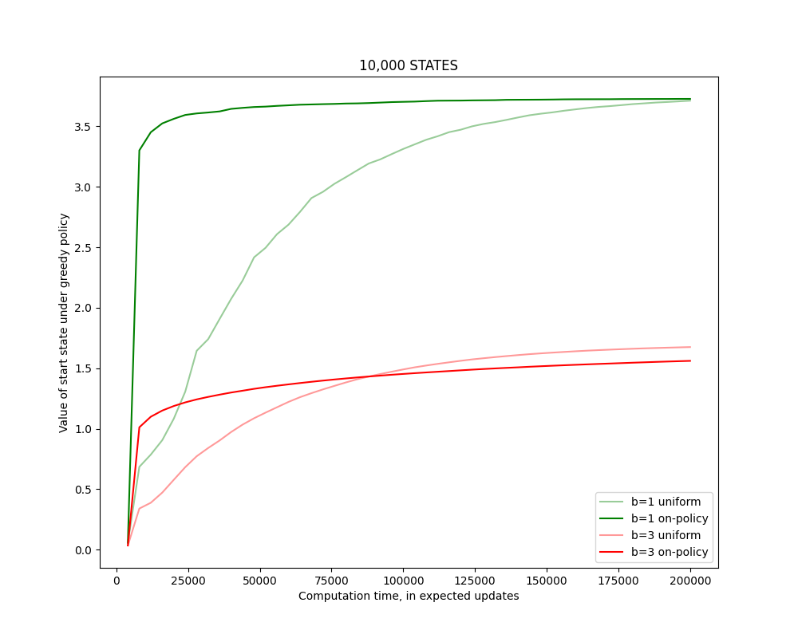

# 第8章 演習問題

# Exercise 8.1

図8.3において、非プラニング手法として複数ステップのブートストラップ法を使用した場合、Dyna法と同じくらいよく振る舞うか？そうはならないか？理由を説明せよ。

## 解答

非プラニング手法として複数ステップのブートストラップ法を使用した場合、Dyna法と同じくらいよく振る舞うとは限らない。
Dyna法は、モデルベースのアプローチであり、環境のモデルを利用してサンプルを生成できるため、効率的に学習を進めることができる。一方、複数ステップのブートストラップ法は、nを大きくしても、実際の環境からのサンプルに依存するため、モデルを持つDyna法ほど効率的ではない。

# Exercise 8.2

探索ボーナス付きのDyna-Q+は、遮断される迷路や近道のある迷路の実験において、なぜ迷路が変化する前の段階でも性能が向上するのか？

## 解答
探索ボーナスにより、迷路が変化する前の段階でも探索が促進され、最適な経路を見つける可能性が高まるためである。

# Exercise 8.3

図8.5で Dyna-Q+ と Dyna-Q の差が一瞬小さくなるのはなぜか？

## 解答
最短経路が見つかったあとは、Dyna-Q+ の探索は無駄になるため、報酬が減少し、Dyna-Q と差が小さくなる。

# Exercise 8.4

探索ボーナス $\kappa \sqrt{\tau}$ を $Q$ 値の更新に入れるのではなく、
行動選択にだけ加える方法はどうか？
それを Gridworld で比較実験し、利点と欠点を説明せよ

## 解答

行動選択にだけ加えるとは、

$$
A \doteq \arg\max_a \left[ Q(s, a) + \kappa \sqrt{\tau(s, a)} \right]
$$

とすること。この方法は、Dyna-Q+（更新式にボーナスを加える）に対して以下の特徴を持つ。

**プログラム**

See Chapter08/exercise_8-4.py.

**利点:**

- Q値が実際の環境の報酬のみに基づいて更新されるため、Q値自体にバイアスがかからない。静的な環境であれば、真の最適価値関数 $q_*$ に収束しやすい（Dyna-Q+のQ値はボーナス分だけ常に過大評価される）。

**欠点:**

- Dyna-Q+（更新にボーナスを含む）では、プランニングによって「しばらく訪れていない状態」への遷移にボーナスが加算され、その価値がバックアップ（更新）を通じて手前の状態へと伝播していく。これにより、エージェントは「遠くにある未探索エリア」を目指すような方策を学習できる。
- 一方、行動選択のみにボーナスを加える場合、 **「その瞬間の次の1手」** にしかボーナスが効かない。ショートカットのように現在地から数ステップ離れた場所で変化が起きている場合、その場所まで行くための「一連の行動」の価値が高まらないため、既知の報酬が高いルート（遠回り）を選び続けてしまう。
- 実験結果（ `exercise_8-4.py` の実行結果）においても、ショートカット開通後にDyna-Q+は素早く近道を見つけて累積報酬の傾きが急になっているが、行動選択ボーナスのみの手法は近道を見つけられず、傾きが緩やかなままである。

# Exercise 8.5

146ページの表形式Dyna-Qアルゴリズムを、確率的な環境に対応させるにはどうすればよいか？
また、その修正は、この節で考えたような変化する環境において、どのような悪影響を及ぼす可能性があるか？
確率的な環境と変化する環境の両方に対応するには、アルゴリズムをどのように修正すればよいか？

## 解答

**1. 確率的環境への対応:**
決定論的なDyna-Qでは、モデル $Model(s, a)$ は単一の次の状態と報酬 $(s', r)$ を返すが、確率的環境ではこれらが分布に従う。
対応策として、モデルは $(s, a)$ に対する過去の遷移履歴（経験した $(s', r)$ のリストや、遷移回数のカウント）を保持するように変更する。
プランニング（シミュレーション）のステップでは、保持している履歴からサンプリング（例：過去の経験からランダムに1つ選ぶ、あるいは推定された確率分布に基づいて生成する）して $(s', r)$ を決定する。

**2. 変化する環境での悪影響:**
環境が変化（非定常）した場合、過去に蓄積された大量の履歴データが「古い知識」として残り続けることが問題となる。
例えば、ある行動の結果が変化したとしても、過去の膨大な「変化前の経験」がモデル内に残っているため、サンプリングされる結果の多くは古い環境に基づいたものとなり、新しい環境への適応が極めて遅くなる（あるいは適応できなくなる）。

**3. 両方に対応するための修正:**
「古い経験を忘れる」あるいは「新しい経験を重視する」仕組みを導入する。
具体的には以下のような方法が考えられる：
- **スライディングウィンドウ:** 各 $(s, a)$ に対して、直近 $k$ 回の経験のみをモデルに保持し、それより古いものは破棄する。
- **重み付けサンプリング:** 経験にタイムスタンプを付け、新しい経験ほど高い確率でサンプリングされるようにする。
- **忘却係数:** 遷移回数のカウントなどを用いる場合、定期的にカウントを減衰させることで、過去の経験の影響力を下げる。

# Exercise 8.6

上記の分析（期待更新とサンプル更新の比較）では、b個の可能性のある次の状態すべてが等しい確率で発生すると仮定していた。そうではなく、その分布が非常に偏っていて、b個の状態のうちいくつかが大半を占めるほど高い確率で発生すると仮定する。この場合、期待更新に対するサンプル更新の優位性は強まるか、弱まるか？

## 解答

この場合、期待更新に対するサンプル更新の優位性は強まる。

期待更新が、ほとんど発生しない多数の遷移のために期待値計算のコストを維持するのに対し、サンプル更新は、学習に最も影響を与える高確率遷移を捉えることができるため、その効率性における優位性は増す。

# Exercise 8.7

図 8.8の一部のグラフ、特に b=1 の一様分布のグラフの初期部分に、なぜ波打つようなパターンが現れるのか、仮説を立てよ。ここで示されているデータのどの側面が、その仮説を支持するか？

## 解答
1ステップの一様更新では、1回の掃き出しで伝搬される価値が1ステップ分（ $s$ と $s'$ の間の直接的な関係）に限定されるため、価値の伝搬が遅い。終了状態に到達するまでの距離が K ステップだとすると、価値が開始状態 $S_0$ ​に伝搬するまで最低でも K 回の掃き出しが必要になる。

グラフの縦軸は開始状態の価値であるから、開始状態に価値が届いた瞬間に大きく上昇し、それまでの間は上昇しない、という階段状のパターンが生じることになる。
特に、 b=1 の場合、環境が決定的になる（各状態から遷移できる次の状態が1つしかない）ため、価値の伝搬がちょうど K ステップごとにしか起こらず、波打つようなパターンが顕著になる。

# Exercise 8.8

図 8.8の下側の実験（10,000状態のタスク）を再現し、さらに分岐因子 (b) を b=3 に変えて同じ実験をせよ。結果について考察せよ。

## 解答

**プログラム**

See Chapter08/exercise_8-8.py.

**図8.8の上側の再現**

**図8.8の下側の再現（b=3追加）**

**考察**

図8.8より、状態数が多く分岐因子 b が小さい場合、on-policy分布に従ったサンプリングの方が期待更新回数あたりの効率が高いことがわかる。
この傾向によると、本実験の結果 (状態数 10,000、b=3) は
- 状態数 10,000、b=1 の場合と比較して、期待更新の優位性が弱まる。
- 状態数 1,000、b=3 の場合と比較して、期待更新の優位性が強まる。

と予想され、先に示した実験結果もその通りとなっている。
