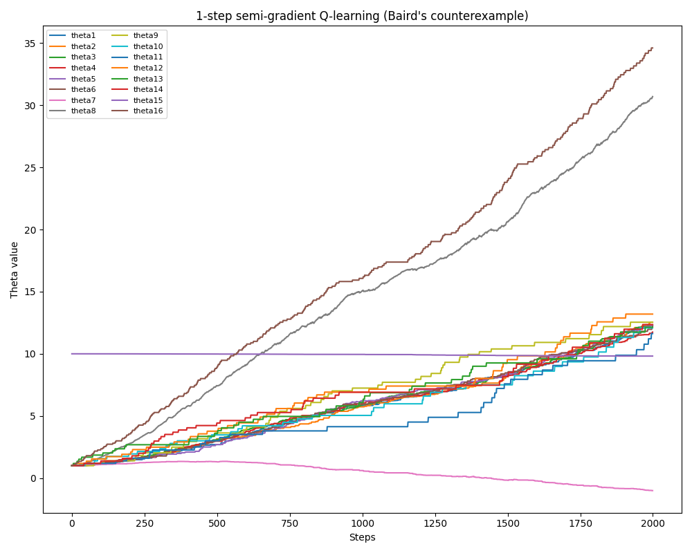

# 第11章 演習問題

# Exercise 11.1

nステップオフ方策TD学習（以下の7.9式）を疑似勾配形法の形式に変換し、エピソード的タスクと連続的タスクそれぞれの収益の定義を与えよ。

$$
\begin{align*}
V_{t+n}(S_t) &\doteq V_{t+n-1}(S_t) + \alpha \rho_{t:t+n-1}  \left[ G_{t:t+n} - V_{t+n-1}(S_t) \right] \\
\rho_{t:h} &\doteq \prod_{k=t}^{\min(h, T-1)} \frac{\pi(A_k|S_k)}{\mu(A_k|S_k)} \\
\end{align*}
$$

## 回答

$\mathbf{w}$ を状態価値関数 $\hat{v}(s, \mathbf{w})$ を近似するための重みベクトルとすると、nステップオフ方策TD学習の疑似勾配形法は以下のように表される。

$$
\begin{align*}
\mathbf{w}_{t+n} &\doteq \mathbf{w}_{t+n-1} + \alpha \rho_{t:t+n-1}  \left[ G_{t:t+n} - \hat{v}(S_t, \mathbf{w}_{t+n-1}) \right] \nabla_{\mathbf{w}} \hat{v}(S_t, \mathbf{w}_{t+n-1}), \quad \text{ for } 0 \leq t < T
\end{align*}
$$

エピソード的タスクにおける収益 $G_{t:t+n}$ は以下のように定義される。

$$
\begin{align*}
G_{t:t+n} &\doteq R_{t+1} + \gamma R_{t+2} + \cdots + \gamma^{n-1} R_{t+n} + \gamma^n \hat{v}(S_{t+n}, \mathbf{w}_{t+n-1}), \quad \text{ for } t+n < T
\end{align*}
$$

$t+n \geq T$ の場合、 $G_{t:t+n}$ はエピソードの終了までの全割引報酬の合計 $G_{t}$ となる。

連続的タスクにおける収益 $G_{t:t+n}$ は、平均報酬 $\bar{R}$ を使って以下のように定義される。

$$
\begin{align*}
G_{t:t+n} &\doteq R_{t+1} - \bar{R}_{t} + R_{t+2} - \bar{R}_{t+1} + \cdots + R_{t+n} - \bar{R}_{t+n-1} + \hat{v}(S_{t+n}, \mathbf{w}_{t+n-1})
\end{align*}
$$

# Exercise 11.2

nステップ $Q(\sigma)$ 法（式7.11, 7.18）を擬似勾配法の形式に変換せよ。エピソード的タスクと連続的タスクそれぞれの場合の定義を与えよ。

$$
\begin{align*}
Q_{t+n}(S_t, A_t) &\doteq Q_{t+n-1}(S_t, A_t) + \alpha \rho_{t+1:t+n}  \left[ G_{t:t+n} - Q_{t+n-1}(S_t, A_t) \right] \tag{7.11} \\
G_{t:t+n} &\doteq R_{t+1} + \gamma \left[ \sigma_{t+1} \rho_{t+1} + (1 - \sigma_{t+1}) \pi(A_{t+1} \mid S_{t+1}) \right] \left[ G_{t+1:h} - Q_{h-1}(S_{t+1}, A_{t+1}) \right] \\
&\quad + \gamma \bar{V}_{h-1}(S_{t+1}) \tag{7.18}
\end{align*}
$$

## 回答

$\mathbf{w}$ を行動価値関数 $\hat{q}(s, a, \mathbf{w})$ を近似するための重みベクトルとすると、nステップ $Q(\sigma)$ 法の疑似勾配形法は以下のように表される。

$$
\begin{align*}
\mathbf{w}_{t+n} &\doteq \mathbf{w}_{t+n-1} + \alpha \rho_{t+1:t+n} \left[ G_{t:t+n} - \hat{q}(S_t, A_t, \mathbf{w}_{t+n-1}) \right] \nabla_{\mathbf{w}} \hat{q}(S_t, A_t, \mathbf{w}_{t+n-1}), \quad \text{ for } 0 \leq t < T
\end{align*}
$$

エピソード的タスクにおける収益 $G_{t:t+n}$ は以下のように定義される。

$$
\begin{align*}
G_{t:t+n} &\doteq R_{t+1} + \gamma \left[ \sigma_{t+1} \rho_{t+1} + (1 - \sigma_{t+1}) \pi(A_{t+1} \mid S_{t+1}) \right] \left[ G_{t+1:h} - \hat{q}_{h-1}(S_{t+1}, A_{t+1}, \mathbf{w}_{h-1}) \right] \\
&\quad + \gamma \bar{V}_{h-1}(S_{t+1}) \\
&= R_{t+1} + \gamma \left[ \sigma_{t+1} \rho_{t+1} + (1 - \sigma_{t+1}) \pi(A_{t+1} \mid S_{t+1}) \right] \left[ G_{t+1:h} - \hat{q}_{h-1}(S_{t+1}, A_{t+1}, \mathbf{w}_{h-1}) \right] \\
&\quad + \gamma \sum_{a} \pi(a|S_{t+1}) \hat{q}(S_{t+1}, a, \mathbf{w}_{h-1})
\end{align*}
$$

$t+n \geq T$ の場合、 $G_{t:t+n}$ はエピソードの終了までの全割引報酬の合計 $G_{t}$ となる。

連続的タスクにおける収益 $G_{t:t+n}$ は、平均報酬 $\bar{R}$ を使って以下のように定義される。

$$
\begin{align*}
G_{t:t+n} &\doteq R_{t+1} - \bar{R}_{t} + \left[ \sigma_{t+1} \rho_{t+1} + (1 - \sigma_{t+1}) \pi(A_{t+1} \mid S_{t+1}) \right] \left[ G_{t+1:h} - \hat{q}_{h-1}(S_{t+1}, A_{t+1}, \mathbf{w}_{h-1}) \right] \\
&\quad + \sum_{a} \pi(a|S_{t+1}) \hat{q}(S_{t+1}, a, \mathbf{w}_{h-1})
\end{align*}
$$

# Exercise 11.3

1ステップ擬似勾配Q学習をBairdの反例に適用し、その重みが発散することを示せ。

## 回答

1ステップ擬似勾配Q学習は以下のように表される。

$$
\begin{align*}
\mathbf{w}_{t+1} &\doteq \mathbf{w}_{t} + \alpha \left[ R_{t+1} + \gamma \max_{a} \hat{q}(S_{t+1}, a, \mathbf{w}_{t}) - \hat{q}(S_{t}, A_{t}, \mathbf{w}_{t}) \right] \nabla_{\mathbf{w}} \hat{q}(S_{t}, A_{t}, \mathbf{w}_{t})
\end{align*}
$$

これをBairdの反例に適用した場合を以下に示す。

code: [exercise_11-3.py](exercise_11-3.py)

# Exercise 11.4

式11.24を証明せよ。

$$
\begin{align*}
\overline{RE}(\mathbf{w}) &= \mathbb{E}\left[ \left( G_t - \hat{v}(S_t, \mathbf{w}) \right)^2 \right] \\
&= \overline{VE}(\mathbf{w}) + \mathbb{E}\left[ \left(G_t - v_{\pi}(S_t) \right)^2 \right]
\end{align*} \tag{11.24}
$$

## 回答

$\overline{RE}(\mathbf{w})$ を状態 $S_t$ の分布 $\mu(s)$ に関する期待値として書くと、

$$
\begin{align*}
\overline{RE}(\mathbf{w}) &= \sum_{s \in \mathcal{S}} \mu(s) \mathbb{E}\left[ \left( G_t - \hat{v}(s, \mathbf{w}) \right)^2 \mid S_t = s \right]
\end{align*}
$$

真の価値 $v_{\pi}(s)$ を誤差項の括弧内に足し引きし、引いた方を収益、足した方を推定価値としてまとめると、

$$
\begin{align*}
\mathbb{E}\left[ \left( G_t - \hat{v}(s, \mathbf{w}) \right)^2 \mid S_t = s \right] &= \sum_{s \in \mathcal{S}} \mu(s) \mathbb{E}\left[ \left( G_t - \hat{v}(s, \mathbf{w}) + v_{\pi}(s) - v_{\pi}(s) \right)^2 \mid S_t = s \right] \\
&= \sum_{s \in \mathcal{S}} \mu(s) \mathbb{E}\left[ \big( \left (G_t - v_{\pi}(s) \right) + \left( v_{\pi}(s) - \hat{v}(s, \mathbf{w}) \right) \big)^2 \mid S_t = s \right]
\end{align*}
$$

二乗を展開すると、

$$
\begin{align*}
\mathbb{E}\left[ \left( G_t - \hat{v}(s, \mathbf{w}) \right)^2 \mid S_t = s \right] &= \mathbb{E}\left[ \left( G_t - v_{\pi}(s) \right)^2 + \left( v_{\pi}(s) - \hat{v}(s, \mathbf{w}) \right)^2 + 2 \left( G_t - v_{\pi}(s) \right) \left( v_{\pi}(s) - \hat{v}(s, \mathbf{w}) \right) \mid S_t = s \right] \\
&=\mathbb{E}\left[ \left( G_t - v_{\pi}(s) \right)^2 \mid S_t = s \right] \\
&+ 2 \mathbb{E}\left[ \left( G_t - v_{\pi}(s) \right) \left( v_{\pi}(s) - \hat{v}(s, \mathbf{w}) \right) \mid S_t = s \right] \\
&+ \mathbb{E}\left[ \left( v_{\pi}(s) - \hat{v}(s, \mathbf{w}) \right)^2 \mid S_t = s \right]
\end{align*}
$$

第一項は状態 $S_t = s$ における収益の分散である。

第2項の $v_{\pi}(s) - \hat{v}(s, \mathbf{w})$ は $S_t = s$ に依存しないため、期待値の外に出せる。

$$
\begin{align*}
2 \mathbb{E}\left[ \left( G_t - v_{\pi}(s) \right) \left( v_{\pi}(s) - \hat{v}(s, \mathbf{w}) \right) \mid S_t = s \right] &= 2 \left( v_{\pi}(s) - \hat{v}(s, \mathbf{w}) \right) \mathbb{E}\left[ G_t - v_{\pi}(s) \mid S_t = s \right] \\
&= 2 \left( v_{\pi}(s) - \hat{v}(s, \mathbf{w}) \right) \left( \mathbb{E}\left[ G_t \mid S_t = s \right] - v_{\pi}(s) \right) \\
&= 2 \left( v_{\pi}(s) - \hat{v}(s, \mathbf{w}) \right) \left( v_{\pi}(s) - v_{\pi}(s) \right) \\
&= 0
\end{align*}
$$

ここで、 $\mathbb{E}\left[ G_t \mid S_t = s \right]$ が真の価値 $v_{\pi}(s)$ に等しいことを用いた。

第3項の $v_{\pi}(s) - \hat{v}(s, \mathbf{w})$ は $S_t = s$ に依存しないため、期待値の外に出せる。

$$
\begin{align*}
\mathbb{E}\left[ \left( v_{\pi}(s) - \hat{v}(s, \mathbf{w}) \right)^2 \mid S_t = s \right] &= \left( v_{\pi}(s) - \hat{v}(s, \mathbf{w}) \right)^2
\end{align*}
$$

したがって、 $\overline{RE}(\mathbf{w})$ は以下のように書ける。

$$
\begin{align*}
\overline{RE}(\mathbf{w}) &= \sum_{s \in \mathcal{S}} \mu(s) \left( \mathbb{E}\left[ \left( G_t - v_{\pi}(s) \right)^2 \mid S_t = s \right] + \left( v_{\pi}(s) - \hat{v}(s, \mathbf{w}) \right)^2 \right) \\
&= \sum_{s \in \mathcal{S}} \mu(s) \mathbb{E\left[ \left( G_t - v_{\pi}(s) \right)^2 \mid S_t = s \right]} + \sum_{s \in \mathcal{S}} \mu(s) \left( v_{\pi}(s) - \hat{v}(s, \mathbf{w}) \right)^2 \\
\end{align*}
$$

ここで、 第一項は期待値の定義から $\mathbb{E}\left[ \left(G_t - v_{\pi}(S_t) \right)^2 \right]$ に等しく、第二項は価値誤差 $\overline{VE}(\mathbf{w})$ に等しい。
したがって、式11.24が成り立つ。

$$
\begin{align*}
\overline{RE}(\mathbf{w}) &= \overline{VE}(\mathbf{w}) + \mathbb{E}\left[ \left(G_t - v_{\pi}(S_t) \right)^2 \right]
\end{align*}
$$
